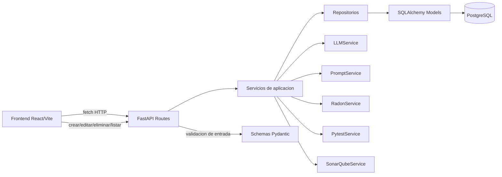

# Investigacion

Proyecto para registrar problemas, tecnicas, experimentos y resultados, con un backend FastAPI, PostgreSQL local y un frontend Vite/React para probar CRUD y ejecuciones de experimentacion.

## Estructura

- `backend/`: API, modelos, servicios y acceso a base de datos.
- `frontend/`: interfaz grafica para CRUD y control de experimentos.
- `investigacion.sql`: esquema original de la base de datos.

## Requisitos

- Python 3.14 con la virtualenv del workspace en `.venv`.
- Node.js 20+.
- PostgreSQL local con usuario `postgres` y base `investigacion`.

## Variables de entorno

Usa los ejemplos incluidos:

- `backend/.env.example`
- `frontend/.env.example`

Para backend puedes copiar el ejemplo a `.env` y dejar, como minimo:

```env
DATABASE_URL=postgresql+psycopg2://postgres@localhost/investigacion
LLM_PROVIDER=openai
LLM_MODEL=gpt-4o
```

Para frontend:

```env
VITE_API_BASE_URL=http://localhost:8000/api/v1
```

## Levantar PostgreSQL

Asegura que el servicio este arriba y que exista la base de datos:

```bash
sudo systemctl start postgresql
sudo -u postgres psql -c "CREATE DATABASE investigacion;"
```

Si la base ya existe, el segundo comando puede fallar con un mensaje de duplicado; en ese caso no pasa nada.

## Levantar backend

```bash
cd /home/HaroldUser/Investigacion/backend
cp .env.example .env
/home/HaroldUser/Investigacion/.venv/bin/python -m uvicorn app.main:app --reload --host 0.0.0.0 --port 8000
```

La API quedara disponible en:

- `http://localhost:8000`
- `http://localhost:8000/docs`

## Levantar frontend

```bash
cd /home/HaroldUser/Investigacion/frontend
cp .env.example .env
npm install
npm run dev
```

La interfaz quedara en:

- `http://localhost:5173`

## Probar CRUD

El frontend permite probar estas operaciones:

- Problemas: crear, listar, editar y eliminar.
- Tecnicas: crear, listar, editar y eliminar.
- Experimentos: crear, listar, editar, eliminar y ejecutar.
- Resultados: crear, listar, editar y eliminar.

Flujo recomendado:

1. Crea primero un problema.
2. Crea una tecnica.
3. Genera un experimento usando ambos registros.
4. Revisa que el backend inserte automaticamente un resultado asociado.
5. Modifica y elimina registros desde la tabla correspondiente.

## Flujo De Datos



### Flujo por capas

1. El usuario interactua con el frontend.
2. El frontend envia peticiones HTTP a las rutas de FastAPI.
3. Las rutas reciben y validan datos con schemas Pydantic.
4. Las rutas delegan en servicios de aplicacion.
5. Los servicios coordinan reglas de negocio, construccion de prompts y ejecucion del LLM.
6. Los servicios usan repositorios para persistir o leer datos.
7. Los repositorios trabajan con SQLAlchemy y la conexion configurada para PostgreSQL.
8. PostgreSQL guarda la informacion final en las tablas del esquema.

### Flujo de experimentacion

1. El frontend selecciona un problema y una tecnica.
2. La ruta de experimento llama al `ExperimentService`.
3. `PromptService` construye el prompt.
4. `LLMService` genera el codigo con el modelo configurado.
5. `RadonService`, `PytestService` y `SonarQubeService` calculan o simulan metricas de analisis.
6. El `ExperimentRepository` guarda el experimento.
7. El `ResultRepository` guarda el resultado asociado.

## Rutas Principales

- `GET /api/v1/problems/`
- `POST /api/v1/problems/`
- `PUT /api/v1/problems/{id}`
- `DELETE /api/v1/problems/{id}`
- `GET /api/v1/techniques/`
- `POST /api/v1/techniques/`
- `PUT /api/v1/techniques/{id}`
- `DELETE /api/v1/techniques/{id}`
- `GET /api/v1/experiments/`
- `POST /api/v1/experiments/`
- `PUT /api/v1/experiments/{id}`
- `DELETE /api/v1/experiments/{id}`
- `POST /api/v1/experiments/execute`
- `GET /api/v1/results/`
- `POST /api/v1/results/`
- `PUT /api/v1/results/{id}`
- `DELETE /api/v1/results/{id}`

## Herramientas Usadas Durante El Desarrollo

Estas son las herramientas que se usaron para construir y validar el proyecto:

- `read_file`: lee archivos concretos del workspace para revisar codigo y configuracion sin modificar nada.
- `list_dir`: lista contenido de carpetas para inspeccionar la estructura del proyecto.
- `file_search`: busca archivos por patron glob cuando se necesita ubicar rapidamente recursos existentes.
- `apply_patch`: aplica cambios a archivos de forma controlada y reproducible; se uso para crear y editar el backend, frontend y la documentacion.
- `get_errors`: revisa errores de sintaxis o de analisis en archivos puntuales o carpetas completas.
- `configure_python_environment`: detecta y configura la virtualenv de Python correcta del workspace.
- `install_python_packages`: instala dependencias Python dentro del entorno configurado.
- `run_in_terminal`: ejecuta comandos de shell como `npm install`, `npm run build` o comandos de servidor.
- `run_task`: ejecuta tareas definidas por VS Code cuando existen; en este proyecto no fue necesario para el flujo final.
- `multi_tool_use.parallel`: agrupa varias lecturas o consultas en paralelo para ahorrar tiempo al inspeccionar el proyecto.

### Definicion practica de cada herramienta

- `read_file`: sirve para ver contenido exacto de un archivo por rangos de linea.
- `list_dir`: sirve para ver carpetas y archivos presentes.
- `file_search`: sirve para localizar archivos por nombre o extension.
- `apply_patch`: sirve para crear o modificar archivos con un diff estructurado.
- `get_errors`: sirve para validar si un archivo compila o tiene errores de analisis.
- `configure_python_environment`: sirve para preparar el entorno Python correcto antes de ejecutar codigo o instalar paquetes.
- `install_python_packages`: sirve para instalar librerias Python en la virtualenv del proyecto.
- `run_in_terminal`: sirve para ejecutar comandos reales de desarrollo, instalacion y build.
- `run_task`: sirve para disparar tareas de VS Code ya declaradas.
- `multi_tool_use.parallel`: sirve para ejecutar varias consultas de lectura al mismo tiempo.

## Verificacion Rapida

Comandos ya probados en el workspace:

- `frontend`: `npm install`
- `frontend`: `npm run build`

El build del frontend termino correctamente.
